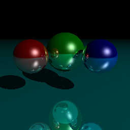

# PTX-EMU
> under development

PTX-EMU is a simple emulator for CUDA program.

You can use it to generate image below like on GPU.



# dependence
- cmake 
- make 
- cuda (test with 11.4.4)
- gcc (test with 10.2.0)

# Usage

## Set up env

```
export CUDA_PATH=/your-path-to-cuda
. setup
```

## Run test
run full test
```
make test
```
run single test
```
# make <name of benchmark>
make RAY
```

## Run single program
After setting up the env, just run it.
```
./bin/RAY 256 256
```

# Mode

## release (default)
Fast execution time
```
make lib
```

## debug
Used with gdb
```
make Dlib
```

## step
Similar to gdb mode.
```
make Slib
```

# 相关技术和架构

## cuda运行时库替换

cudart 为cuda运行时库(cuda runtime)，在nvcc编译过程中默认情况会静态链接cudart，而通过编译参数的修改 `--cudart shared` 或 `-lcudart` 可以实现动态链接cudart(libcudart.so)。LD_LIBRARY_PATH 为linux程序动态链接库的搜索路径，我们可以先生成fake cudart，之后将fake cudart的路径加入LD_LIBRARY_PATH来实现程序运行时链接到fake cudart。

## cuda运行时模拟

可以先实现几个关键的cuda运行时函数，之后再逐渐完善。
一些关键的运行时函数包括

- __cudaRegisterFatBinary 由于NVIDIA并没有公布fatcubin的解析方法，所以我们可以利用`/proc/self/exe`获得当前程序的绝对路径，再利用NVIDIA提供的反汇编工具cuobjdump获得kernel的PTX代码，之后再通过仿真执行kernel的PTX代码实现整个cuda程序的仿真。
- cudaMalloc 和 cudaMallocManaged 可以直接通过 malloc 实现
- cudaMemcpy 和 cudaMemcpyToSymbol 可以直接通过 memcpy 实现
- cudaMemset 可以直接通过 memset 实现
- cudaFree 可以直接通过 free 实现
- __cudaPushCallConfiguration 记录下gridDim，blockDim，共享内存大小和stream
- cudaLaunchKernel 启动对应kernel的PTX仿真
- cudaRegisterVar 记录const变量的地址

## PTX仿真

为什么要在PTX级别上仿真而不是在SASS层面？因为NVIDIA对于PTX有着详尽的指令集描述，而对于SASS层面信息寥寥无几(在cuda binary utilities上每条指令仅有简单的一句话描述)。

如何实现PTX仿真？常见的仿真器或解释器的实现方式为词法分析，语法分析，语义提取，解释执行。PTX作为一个汇编语言在词法和语法上并不是很复杂，所以实现的重点是在语义提取和解释执行上。常见的词法语法分析框架有flex和bison以及antlr4。

## PTX-EMU

PTX-EMU的主要架构和之前的描述一致，其中PTX仿真部分采用的是antlr4来进行词法语法分析，antlr4会自动生成一颗语法树，可以通过遍历这个语法树来实现语义提取，而最重要的解释执行大体上来说就是定义抽象层级kernel(包涵kernel参数等抽象)，thread block(包含shared memory等抽象) 和 thread(包含寄存器等抽象)，遍历每个线程然后依次仿真每一条PTX指令。

目前已经可以通过一些复杂程序的测试(包含上千条PTX指令的kernel仿真)，比如光线追踪程序可以仿真生成图片。

## 相关参考

- gpgpu-sim https://github.com/accel-sim/gpgpu-sim_distribution
- cudart https://docs.nvidia.com/cuda/cuda-runtime-api/index.html
- SASS https://docs.nvidia.com/cuda/cuda-binary-utilities/index.html#instruction-set-reference
- PTX-isa https://docs.nvidia.com/cuda/parallel-thread-execution/index.html
- cuda https://docs.nvidia.com/cuda/

## 项目开发计划

- 目前PTX-EMU仅支持到Ampere架构，新推出的Hopper架构(引入新的线程抽象层次thread block cluster)并不支持，可以考虑支持新的架构
  
- 目前PTX-EMU支持的PTX指令有限，例如并没有支持tensor core相关的指令(wmma 和 mma)，可以考虑扩展demo支持的PTX指令
  
- 目前PTX-EMU支持的CUDA runtime API并不完善，比如关于event相关的API会直接返回，并没有实现相关逻辑，可以考虑完善扩展支持的CUDA runtime API
  
- 目前关于PTX-EMU的文档并不详尽，可以考虑增加使用说明和开发说明文档
  
- 目前CUDA程序测例并不是很多，可以考虑增加CUDA程序测例

